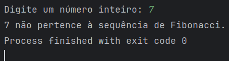

# teste-target

---

 - 1º exercício resulta em : 91

---
 ## Segundo exercício
Primeiro fui relembrar a lógica da sequência de Fibonacci para implementar uma lógica que utilize dela.
1. Declarei a entrada do usuário e atribuí o valor da entrada em uma variável.
2. Criei a o método fibonacci que vai cuidar da lógica da sequência que é:
   1. Defini a variável `a` para que represente o número atual da sequência e atribuí o valor de 0 que é o primeiro número.
   2. Defini a variável `b` para que represente o próximo termo da sequência e atribuí o valor de 1.
   3. Defini a variável `temporaria` para ajudar na atualização dos valores de `a` e `b` durante a iteração.
   4. Coloquei uma condicional verificando se o número fornecido na entrada é menor do que 0, porque se for menor do que 0 ele não pertencerá à sequência.
   5. O `while` continuará executando enquanto o valor de `a` (que é o número atual da sequência) for menor do que `num`.
   6. Dentro do `while`, a variável `temporaria` armazena o valor de `a`, pois o valor de `a` será atualizado para `b`.
   7. `a` é atualizado para o valor atual de `b` (o próximo número da sequência).
   8. `b` é atualizado para a soma dos antigos valores de `a` e `b` (`temporaria` + `b`), que resulta no próximo número da sequência.
   9. Após sair do `while`, `a` terá o valor do último número da sequência que é menor ou igual a `num`.
   10. O método retornará `true` se `a` for igual ao número fornecido `num`, indicando que `num` pertence à sequência. Caso contrário retorna `false`.
> Fiz dessa maneira para que o método calcule os números da sequência de Fibonacci apenas até o número de entrada, sem gerar todos os números da sequência infinitamente. Pensei também em utilizar recursão, porém achei esse método mais eficiente para o proposto.
---

> Exemplo retornando `true`

---

> Exemplo retornando `false`
---
