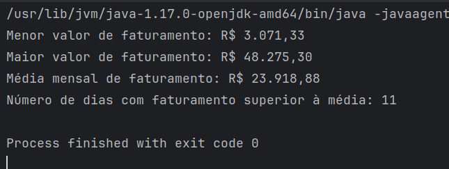

# teste-target

---

 - 1º exercício resulta em : 91

---
 ## Segundo exercício
Primeiro fui relembrar a lógica da sequência de Fibonacci para implementar uma lógica que utilize dela.
1. Declarei a entrada do usuário e atribuí o valor da entrada em uma variável.
2. Criei a o método fibonacci que vai cuidar da lógica da sequência que é:
   1. Defini a variável `a` para que represente o número atual da sequência e atribuí o valor de 0 que é o primeiro número.
   2. Defini a variável `b` para que represente o próximo termo da sequência e atribuí o valor de 1.
   3. Defini a variável `temporaria` para ajudar na atualização dos valores de `a` e `b` durante a iteração.
   4. Coloquei uma condicional verificando se o número fornecido na entrada é menor do que 0, porque se for menor do que 0 ele não pertencerá à sequência.
   5. O `while` continuará executando enquanto o valor de `a` (que é o número atual da sequência) for menor do que `num`.
   6. Dentro do `while`, a variável `temporaria` armazena o valor de `a`, pois o valor de `a` será atualizado para `b`.
   7. `a` é atualizado para o valor atual de `b` (o próximo número da sequência).
   8. `b` é atualizado para a soma dos antigos valores de `a` e `b` (`temporaria` + `b`), que resulta no próximo número da sequência.
   9. Após sair do `while`, `a` terá o valor do último número da sequência que é menor ou igual a `num`.
   10. O método retornará `true` se `a` for igual ao número fornecido `num`, indicando que `num` pertence à sequência. Caso contrário retorna `false`.
> Fiz dessa maneira para que o método calcule os números da sequência de Fibonacci apenas até o número de entrada, sem gerar todos os números da sequência infinitamente. Pensei também em utilizar recursão, porém achei esse método mais eficiente para o proposto.
---

> Exemplo retornando `true`

---

> Exemplo retornando `false`
---
## Terceiro exercício
Para a resolução desse exercício utilizei apenas o Java sem buscar bibliotecas externas.
1. Criei um objeto File apontando para o arquivo `xml`, onde estão os dados.
2. Instanciei uma "fábrica" da classe `DocumentBuilderFactory` para que consiga criar objetos `Document`.
3. Criei um `DocumentBuilder` a partir da fábrica.
4. Com a classe `Document` transformei o arquivo `xml` em um objeto `Document`.
5. Normalizei o `xml` para garantir que os dados estejam consistentes.
6. Com a variável `rowList` do tipo `NodeList`, obtive uma lista com todos os elementos `<row>` no documento `xml`.
7. Criei uma lista `faturamentos` para armazenar os valores de faturamento diário.
8. Inicializei uma variável `totalFaturamento` com o valor 0.0 para somar todos os valores de faturamento.
9. Declarei um `for` para iterar sobre os elementos `<row>`
10. Criei a variável `rowNode` para obter o nó atual da lista.
11. Fiz a verificação se o nó é verdadeiramente um elemento, e não um texto ou comentário.
12. Com a variável `rowElement` fiz um cast do nó para um `Element` para conseguir acessar seus filhos e atributos.
13. Obtive o valor do faturamento do elemento `faturamento` e converti para Double.
14. Verifiquei se o faturamento é maior do que 0, para que seja ignorado, como proposto.
15. Adicionei o valor do faturamento à lista.
16. Adicionei o valor do faturamento à variável `totalFaturamento`.
17. Criei a lógica dos cálculos, usando `stream()`.
18. Exibi os resultados.

**Resultado →**

---
## Quarto exercício
1. Usei a estrutura `map` para armazenar cada estado como chave e seu respectivo valor.
2. Calculei o faturamento total pegando os valores de faturamento, e utilizando a `stream api`.
3. Fiz a formatação de vírgulas e pontos no valor.
4. Calculei o percentual.
5. Exibi o resultado.

**Resultado →**

---
## Quinto exercício
1. Declarei a variável para receber o valor da entrada por teclado com o `Scanner`.
2. Desenvolvi o método
     - Declarei um vetor de caracteres com o mesmo tamanho da string original.
     - Fiz a iteração sobre esse vetor, colocando o caractere da posição inversa da string original.
     - Converti o vetor para string.
     - Chamei o método passando a string original como argumento.
     - Exibi o resultado.

**Resultado →**

---